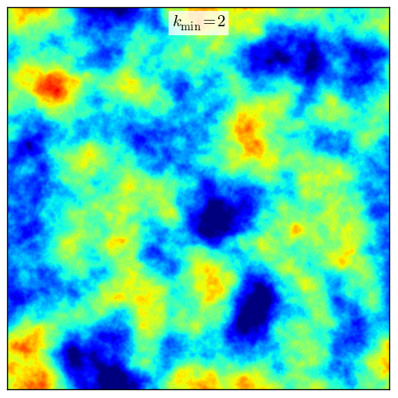
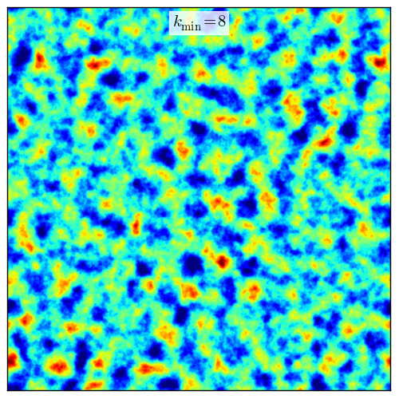
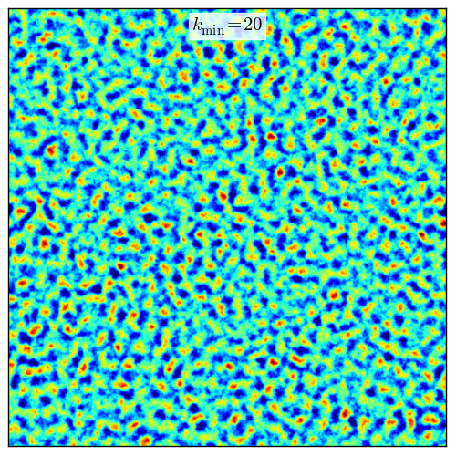
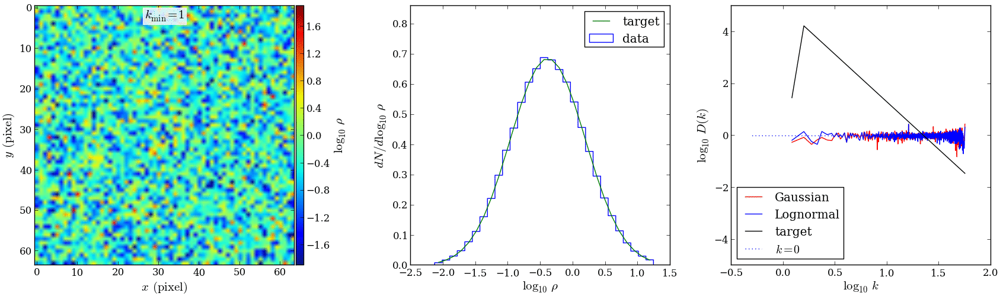

Fractal Cubes
=============

.. contents:: On this page...
   :local:
   :backlinks: top

General Properties
------------------

We refer to "fractal cubes" as randomly generated scalar fields in three-dimensional cartesian space, :math:`\rho(x_1, x_2, x_3)`, from some probability distribution function (PDF), :math:`P(\rho)`, and fractal correlation in space. The two-point fractal distribution is established by a power-law spectrum :math:`D(k)` in Fourier space, and characterized by the slope of the power-law, :math:`\beta`, the Nyquist limit :math:`k_\mathrm{max}`, and a lower cutoff wavenumber, :math:`k_\mathrm{min}`. 

Let :math:`F(\mathbf{k})` be the Fourier transform of the spatial density distribution, :math:`\rho(\mathbf{r})`, with :math:`\mathbf{k}` and :math:`\mathbf{r}` as wave vector and position vector, respectively.

.. math::

  D(k) = \int k^2 F(\mathbf{k}) F^{*}(\mathbf{k}) d \Omega \propto k^\beta\;,

where the integral of the spectral density, :math:`F(\mathbf{k}) F^{*}(\mathbf{k})`, is over all solid angle, :math:`\Omega`.

The target spectrum is generally chosen to have a slope representative of the density or velocity field of turbulent flow, e.g. a Kolmogorov spectrum :math:`\beta=-5/3`, which is the default in the classes.

It is sometimes useful to restrict the largest or smallest spatially correlated scales contained in the fractal cube. The lower cutoff wave number restricts sampling, and therefore fractal structure, to scales smaller than :math:`L/k_\mathrm{min}`, where :math:`L` is the width of the cube. This is a useful parameter in controlling the size scale (or column depth) of structure in the fractal cube. The Nyquist limit, :math:`k_\mathrm{max,i} = (n_i + 1)/2`, sets the smallest correlated scales, and is used as the upper sampling wavenumber limit.

The main functionality of the pyFC module is to generate a lognormal fractal cube for a scalar field :math:`\rho`, but there is also a class that represents gaussian fractal cubes. Note that, although we refer to fractal cubes as cubes, they may in fact be cuboidal. The code, however, currently only properly supports cubes currently, that is :math:`n_i = n_j = n_k`, where these are the number of cells in the :math:`i`, :math:`j`, and :math:`k` directions of the fractal cube. 

Since fractal cubes are generated purely by manipulations in the fourier space of the scalar field, the fractalc cube is by construction periodic and can be trivially tesselated.

Lognormal Fractal Cubes
-----------------------

Lognormal fractal cubes obey a single-point lognormal PDF characterized by the mean, :math:`\mu`, and variance, :math:`\sigma^2` of the distribution.

.. math::

   P(\rho) = \frac{1}{s\sqrt{2\pi}\rho}\exp\left(\frac{-(\ln\rho - m)^2}{2s^2}\right)\;.

Construction
^^^^^^^^^^^^

A lognormal fractal cube is generated by an iterative procedure that attempts to simultaneously ensure that the scalar field obeys a single-point lognormal PDF and a two-point fractal distribution, that is, a power-law in Fourer space. Technically, the aim of the iterative procedure is to find the apodization spectrum for the Gaussian random field, which gives a lognormal fractal cube. The steps of the iteration procedure is as follows:

  1. Construct in real space a cube of random variables from a Gaussian PDF, with mean, :math:`m`, and variance, :math:`s^2`.
  2. Use a Fast Fourier Transform (FFT) to obtain the power spectrum of the Gaussian field.
  3. Apodize (multiply) the power spectrum with the target power-law power spectrum, which is first normlized so that the mean and variance of the field is preserved.
  4. Use an inverse Fast Fourier Transform (iFFT) to obtain a spatially correlated random Gaussian field.
  5. Exponentiate the cube to obtain a spatially correlated random lognormal field.
  6. FFT of the lognormal field shows, however, that its power spectrum is not a power-law. The deviation from a power-law is calculated and a correction is applied to the apodization spectrum.
  7. The procedure from 3. is repeated and successive corrections are applied until the lognormal field attains a power-law spectrum whose deviation from the target spectrum is within an acceptable tolerance.

The mean, :math:`m`, and variance, :math:`s^2` of the underlying Gaussian distribution are related to the mean, :math:`\mu`, and variance :math:`\sigma^2` of the lognormal distribution by:

.. math::

   m = \ln\frac{\mu^2}{\sqrt{\sigma^2 + \mu^2}} \;, \quad s = \sqrt{\ln\left(\frac{\sigma^2}{\mu^2} + 1\right)}\,.

The process of convergence in the generation of a lognormal fractal cube is shown in the figure below for successive iterations. About 3 to 7 iterations are required. The left panel shows a midplane slice of the lognormal field, the central panel shows the PDF of :math:`\log_{10}(\rho)`, which is Gaussian for a lognormal field, and the right panel shows the isotropic power spectrum of the gaussian field, which is apodized with the succesively corrected power spectrum, the isotropic spectrum of the lognormal field (which is simply the exponentiated Gaussian field), and the target power-law spectrum (black solid line). The convergence is measured with respect to the power-spectrum. In the process of modifying the apodization spectrum, although it remains normalized, the single-point PDF may deviate slightly from the target spectrum.

   Left: Midplane slice, Middle: single-point lognormal PDF, and Right: power-law isotropic power spectrum.

Gaussian Fractal Cubes
----------------------

A class and functions also exist to generate fractal cubes with single-point Gaussian statistics, described by the mean and variance. These are useful to generate velocity dispersions. 

Future work includes combining lognormal and Gaussian fractal cubes in a consistent way to be used in hydrodynamic simulations.

Implementation in hydrodynamic simulations and generating porosity
------------------------------------------------------------------

Coming soon.

.. To place the fractal cube into the simulation domain it is apodized (in real space) by a spherically symmetric mean density profile which in the simulations presented here is flat with mean warm phase density $\nwarmav$. The porosity of the warm phase arises by imposing an upper temperature cutoff for the existence of clouds at $T_\mathrm{crit}=3\times10^4\Kv$, beyond which clouds are deemed thermally unstable. No lower temperature limit is enforced, and temperatures in the core of clouds may initially be less than $100\Kv$. The upper temperature cutoff corresponds directly to a lower density cutoff, $\rhocrit=\muhot p/(k \Tcrit)$, if the pressure, $p$, is defined. Here, $\muhot$ is the mean mass per particle of the hot phase. In our simulations the clouds are in pressure equilibrium with the surrounding hot phase, thus $\rhocrit=\muhot \nhot \Thot/\Tcrit$, where $\nhot$ and $\Thot$ are the hot phase number density and temperature, respectively. The filling factor of the warm phase, within the hemispherical region of radius $0.5\kpc$, in which it is distributed, is: 
..   \fvol&=&\int_{\rhocrit}^\infty P(\rho) \ud \rho \nonumber\\
..   &=&\frac{1}{2}\left[1 + \erf\left(\frac{\ln\left\{(\rhocrit/\mu)\sqrt{\sigma^2/\mu^2 + 1}\right\}}{\sqrt{2\ln\left(\sigma^2/\mu^2 + 1\right)}} \right)\right]

