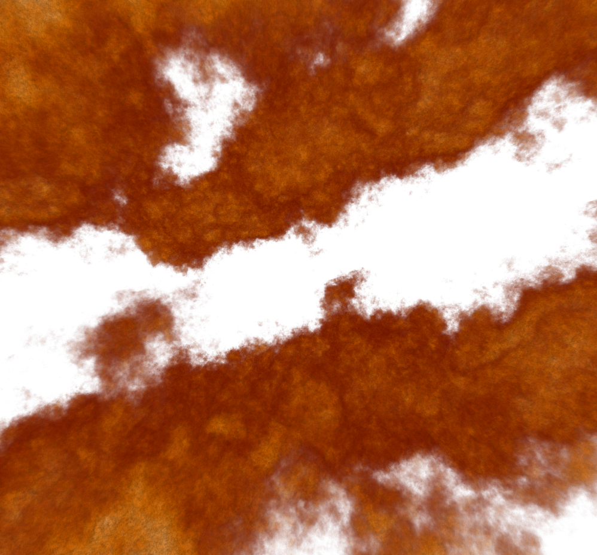

.. pyFC documentation master file, created by
   sphinx-quickstart on Fri Dec 27 15:13:07 2013.
   You can adapt this file completely to your liking, but it should at least
   contain the root `toctree` directive.

Introduction
============

pyFC is a module to construct "fractal cubes" that are useful for initial conditions in hydrodynamical simulations representing a dense, inhomogeneous component embedded in a more tenuous smooth background. Examples include clouds in earth's athmosphere or the multiphase interstellar medium in galaxies. 

Classes and functions are provided to create and visualize single-point lognormal, two-point fractal fields, statistics often associated with turbulent, dense condensations.

The method of creating lognormal "fractal cubes" was conceived by `Lewis & Austin (2002)`_ for the modeling of clouds in the earth's atmosphere. The scheme of this code is based on that outlined in their paper.

.. _Lewis & Austin (2002): https://ams.confex.com/ams/11AR11CP/techprogram/paper_42772.htm

Contents
========

.. toctree::
   :maxdepth: 3

   quickstart
   fractal_cubes
   demo
   api_ref

Indices and tables
==================

* :ref:`genindex`
* :ref:`modindex`
* :ref:`search`

License and Disclaimer
======================

The code is free and open source under the terms of the `GNU Lesser General Public License (LGPL) <http://www.gnu.org/licenses/lgpl.html>`_, and comes without warranty. The content of this documentation is licensed under `GNU Free Documentation License <http://www.gnu.org/copyleft/fdl.html>`_.
