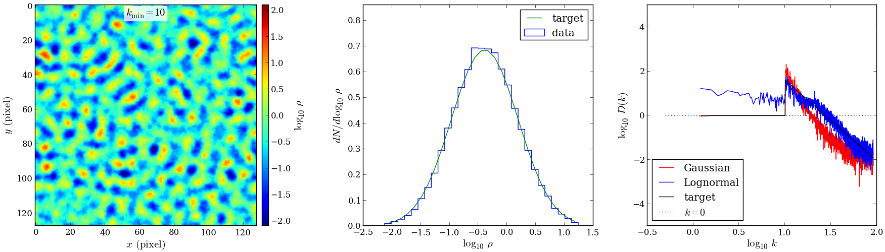

.. sectnum::
   :start: 1

Quickstart
==========

.. contents:: On this page...
   :local:
   :backlinks: top

Requirements
------------

  - Python 2.7 or above. (Tested mainly with Python 2.7.x)
  - NumPy
  - matplotlib (for visualization routines)
  - SciPy (if using FCStats)
  - Generating large cubes requires sufficient memory on the system

Installation
------------

The simplest way to install the module is::

  pip install pyFC

To upgrade the module::

  pip install -U pyFC

The package can be downloaded at `<https://pypi.python.org/pypi/pyFC>`_.

You can get the most recent source code from bitbucket::

  git clone https://bitbucket.org/pandante/pyfc.git

Or download zipped versions here: `tar.gz <https://bitbucket.org/pandante/pyfc/get/master.tar.gz>`_ | `zip <https://bitbucket.org/pandante/pyfc/get/master.zip>`_

Generating or loading a fractal cube
------------------------------------

To load the pyFC module (making sure pyFC in your ``PYTHONPATH``)::

  import pyFC

Create a fractal cube object and generate a lognormal fractal cube with default parameters::

  fc = pyFC.LogNormalFracalCube()
  fc.gen_cube()

A cube can also be read from a data file. In this case, the statistical parameters should be given when creating the fractal cube instance::

  fc = pyFC.LogNormalFracalCube(ni=128, nj=128, nk=128, kmin=1, mean=1, 
                                sigma=np.sqrt(5.), beta=-5./3.)
  fc.read_cube(<fname>)

The fractal cube data is in the object member ``fc.cube``. The statistical parameters are also contained as members of the object, ``fc.mean``, ``fc.sigma``, ``fc.kmin``, ``fc.beta``, ``fc.n{ijk}``.

Manipulating fractal cubes
--------------------------

Functions exist to manipulate fractal cube objects: :func:`pyFC.slice`, :func:`pyFC.tri_slice`, :func:`pyFC.translate`, :func:`pyFC.permute`, :func:`pyFC.mirror`, :func:`pyFC.extract_feature`, :func:`pyFC.lthreshold`, :func:`pyFC.pp_raytrace`, :func:`pyFC.mult`, :func:`pyFC.pow` . (They are associated with the classes :class:`pyFC.FCSlicer`, :class:`pyFC.FCAffine`, :class:`pyFC.FCExtractor`, :class:`pyFC.FCRayTracer`, :class:`pyFC.FCDataEditor`, :class:`pyFC.FCStats`).

For example,::

  pyFC.mirror(fc, ax=1)

would return a copy of a fractal cube with the data mirrored (in both directions) at the mid-plane along the first axis. The transformations can also be done "in place", such that the same instance is modified::

  pyFC.mirror(fc, ax=1, out='inplace')

Manipulation routines are also members of the cube object itself. E.g. :func:`fc.mirror()`.

To write the fractal cube as data use the routine::

  pyFC.write_cube(<fname>)

The data is written out in a binary file in double precision with the field flattened to 1 dimension in C-ordering.

Visualizing fractal cubes
-------------------------

A number of plotting routines exist to visualize the scalar field and statistical distribution fractal cube. They are useful as such to quickly visualize the scalar field, PDF, and power spectrum of the fractal cube.

Of these :func:`pyFC.plot_field_stats` is particularly handy as it displays a mid-plane slice, the PDF, and the power spectrum in one figure with three panels.

For example:: 

  import pyFC
  import matplotlib.pyplot as pl
  import matplotlib.cm as cm

  pl.ion()

  fc = pyFC.LogNormalFractalCube(ni=3, nj=128, nk=128, kmin=10, mean=1)
  fc.gen_cube()
  pyFC.plot_field_stats(fc, scaling='log', vmin=-2.1, vmax=2.1, cmap=cm.jet)

produces the following plot three-panel figure:

Other functions are ``plot_midplane_slice``, ``plot_raytrace``, ``plot_power_spec``, ``plot_pdf``, and their respective ``paint_<...>`` versions. The former create a figure and draw the respecitve plot, wheras the latter "paint" the plot into axes provided in the argument. This allows for custom arrangement of multi-panel figures. 

